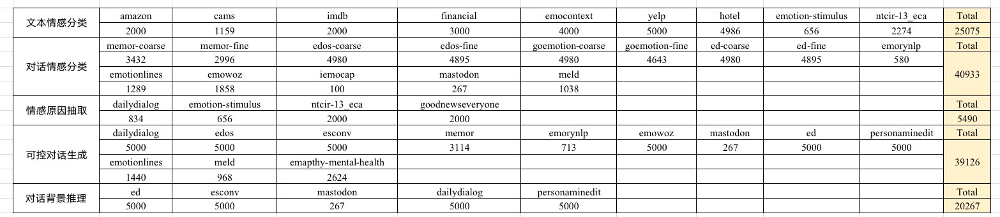
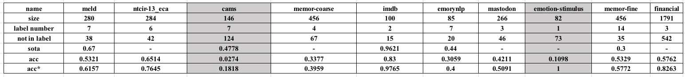

# Emo-LLM
## 训练日志

6月10日 第一次训练

* basemodel: 
    llama-7b

* 训练策略：
    lora, data parallel
* 训练设备：
    a6000 双卡

* 数据集：
  * 配比：
    
  * 格式：concat
* 超参数：
```
batchsize: 128, minibatch: 64, lr: 3e-4, cutoff: 512, epoch: 2, warm up: 100
lora_r: 8, lora_alpha: 16, lora_dropout: 0.05
target_modules: q, k, v, down, gate, up
```
训练结果：



6月13日 第二次训练

* basemodel: 
    llama-7b

* 训练策略：
    lora, data distributed parallel
* 训练设备：
    a6000 双卡

* 数据集：
  * 配比：
    在上一个的基础上删掉了emowoz（这个数据集有问题，需要修改）
  * 格式：alpaca
* 超参数：
```
batchsize: 128, minibatch: 16, lr: 3e-4, cutoff: 512, epoch: 3, warm up: 0.1 ratio
lora_r: 8, lora_alpha: 16, lora_dropout: 0.05
target_modules: q, k
```
训练结果：
