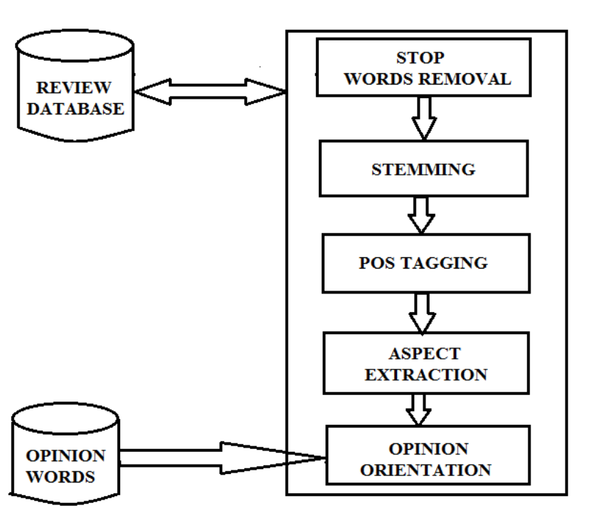

[**中文**](./README.md) | [**English**](./README_EN.md)

<p align="center" width="100%">
<a href="https://github.com/NEU-DataMining/Emo-LLM" target="_blank"></a>
</p>

# Emo-LLM: A comprehensive language model with satisfying empathetical ability

本项目收集了文本情感分析、对话情感分析、个性对话生成、共情对话、情感原因对提取五个领域三十多个数据集，经过对比和筛选，保留了其中23个数据集，同时对满足条件的数据集进行多任务改造，最终得到35个不同版本的数据集，分别用于五类不同的任务训练：文本情感分类、对话情感分类、情感原因对提取、可控对话生成、对话情景推理。然后以。。。模型为基座，利用整合得到的数据进行。。。的训练。在共情任务上，。。。。。在其他方面的任务上，。。。。。

### 更新

暂无更新

### 使用指南

模型的环境是
安装的依赖包有
下载。。到。。。。。
运行以下命令行，把路径改为。。。所在路径

```
bash emo-llm
ssh victory/of/NEU-Data_Mining
```

### 效果展示

下面的视频展示了我们的emo-llm的实际使用效果

### 数据集

使用的数据集包括情感分析领域的各方向的公共数据集，经过筛选、任务改造、格式整合得到最终数据集。

#### 任务改造

如何把分类任务与生成任务互相转化
如何添加进指令

#### 格式整合

所有数据集整合到以下格式
* 'task_type'：所属于的训练任务类型
* 'dataset'：所用数据集名称
* 'instruction': 指令
* 'instances'：训练样本 
* 'is_classification'：区分生成任务和分类任务
*  'name'： 具体数据集做的任务名称

### 任务描述

Emo-LLM模型主要在以下五类任务中训练，激发大语言模型的语言知识和共情能力：

#### 文本情感分类

该任务给定一段文本及候选情感标签，让模型选择适当的情感标签,让模型具有对文本中情感进行分类的能力。

#### 对话情感分类

该任务给定历史对话、当前对话、候选情感标签，让模型选择恰当的情感标签，让模型能够理解和识别对话中的情感。

#### 情感原因抽取

该任务给定一段文本或对话，找到其中的情绪语情绪的原因，帮助模型深入理解句子中的情感及其原因，进一步提高模型的情感分析能力。

#### 可控对话生成

该任务给定一段对话历史，给定控制信息，生成回复，让模型能够根据控制信息生成符合要求的对话。

#### 对话背景推理

该任务给定一段对话，推理对话背景，让模型能够基于对话内容和上下文推理对话的情景等信息，提高对话系统的智能交互效果。

### 模型训练

#### 训练架构与方式

#### 模型特色

* **输出模块设计：**
* **迭代式情感与个性适应：**

### 模型评估

#### 基线模型介绍

#### 训练结果与分析

### 项目参与人员

### 致谢

### 引用

```
@misc{    ,
      title={   },
      author={   },
      year={2023},
      eprint={   },
      archivePrefix={arXiv},
      primaryClass={    }
}
```
