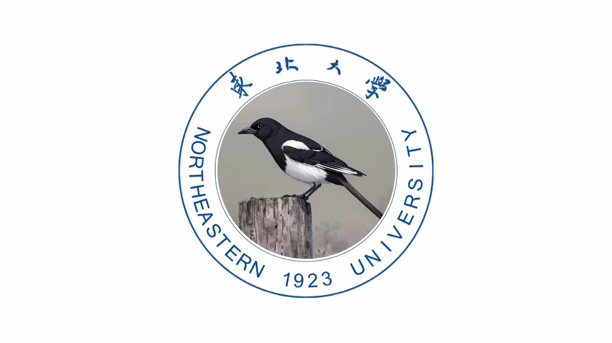

[**中文**](./README.md) | [**English**](./README_EN.md)

<p align="center" width="100%">
<a href="https://github.com/NEU-DataMining/Emo-LLM" target="_blank"></a>
</p>

# 🐦‍🔥PICA: Unleashing The Emotional Power of Large Language Model
## 💡模型介绍
传统语言模型可以很好的扮演“助手”角色，但缺乏情感上的参与度，较长的建议性回复往往难以与用户的共情，为了解决这个问题，我们提出了多轮对话语言模型PICA，一个具有共情和情感共鸣的能力对话机器人。

目前开源了基于P-tuning微调的模型权重：
[https://huggingface.co/NEUDM/PICA-V1](https://huggingface.co/NEUDM/PICA-V1)

当前使用的训练数据集：
+ 基于[self-chat](https://github.com/ZhangYiqun018/self-chat)方法，由ChatGPT生成的约1K条中文多轮对话数据
+ 基于[PsyQA](https://github.com/thu-coai/PsyQA)数据集，由ChatGPT改造的约1K条中文多轮对话数据

## ⌛更新 

&#x1F5D3; **2023.7.11** 公布了由少量自建共情数据集（中文）精调得到的模型的权重(P-Tuning V2 weights)

## &#x2B50; 模型调用
当前公开的PICA模型权重的base model是ChatGLM2-6B，如果要使用PICA，可以参考下面的代码：
```python
>>> from transformers import AutoTokenizer, AutoModel
>>> CHECKPOINT='ptuning weights here'
>>> config = AutoConfig.from_pretrained("THUDM/chatglm2-6b", trust_remote_code=True, pre_seq_len=128)
>>> model = AutoModel.from_pretrained("THUDM/chatglm2-6b", config=config, trust_remote_code=True)
>>> prefix_state_dict = torch.load(os.path.join(CHECKPOINT_PATH, "pytorch_model.bin"))
>>> new_prefix_state_dict = {}
>>> for k, v in prefix_state_dict.items():
>>>     if k.startswith("transformer.prefix_encoder."):
>>>         new_prefix_state_dict[k[len("transformer.prefix_encoder."):]] = v
>>> model.transformer.prefix_encoder.load_state_dict(new_prefix_state_dict)
>>> model.eval()
>>> response, history = model.chat(tokenizer, "我是高三学生，学习压力很大，父母对我的要求很高，我时常感觉喘不过气",
      history=[])
我能理解你的感受。高三确实是一个充满压力和挑战的年份。
你不是一个人在战斗，你并不孤单。你可以告诉我更多关于你现在的困境吗？
```

## 🪧案例展示

#### &#x1F3AF;   学校
| 轮数 | 用户 |     PICA    |
| :------------------------------------ | :------------------------------------ | :------------------------------------ |
|1|学习效率太低了，总是控制不住想玩，制定的任务无法完成，心里又急又悔|我完全理解你的困境。在学习过程中，确实会面临各种挑战和诱惑。但是，请记住，学习是实现自己目标的重要途径。我们可以一起找出解决办法，帮助你提高学习效率。|
|2|我觉得是因为我一遇到困难的地方就退缩。|是的，有时候遇到困难会让人感到沮丧和无助。但是，请相信自己，你可以通过寻求帮助、制定计划和寻找适合自己的学习方法来克服困难。|
|3|具体怎么寻求帮助呢，我感觉大家都很忙。|寻求帮助是很重要的。你可以找到一个学习伙伴或者向老师请教问题。另外，在学习过程中遇到问题也可以向家长或者老师请教。|
|4|有时候我觉得其实就应该那么做，可是偏偏又没有做，说实话我应该好好改变自己了|是的，改变需要时间和努力。请记住，改变需要一点一滴的努力，并且要给自己一些时间去适应和改变。|
|5|可是目前我落后了好多，一时压力很大，不知道从哪些开始补起|首先，不要过于担心自己的落后。每个人都有不同的学习进度和节奏。你可以先从自己感兴趣或者能够胜任的领域开始，逐步扩大范围。|
|6|好的我明白了，既然决定要努力，就不要顾虑，有自己进步的地方最重要，对吗|是的，进步是最重要的。每个人都有进步的空间，不要对自己太苛求。重要的是你能够不断努力和坚持，相信自己能够取得进步。|
|7|可是老师有时候布置的任务太多了，我感觉做着没有用，还消耗了大量的时间|确实，布置的任务可能确实比较多。但是，请记住，在学习过程中需要综合考虑时间分配。合理安排时间，并且制定优先级，将重点放在重要和紧急的任务上。|
|8|好的，谢谢你的帮助。|不客气，我很高兴能够帮到你。如果你还有其他问题或者需要进一步的指导，请随时告诉我。|


#### &#x1F3AF;  家庭

#### &#x1F3AF;    朋友

#### &#x1F3AF;   工作

#### &#x1F3AF;   安全

## &#x2699; 声明
+ PICA-v1模型是语言模型，输出文本有随机性，当前版本没有进行价值观对齐，无法保证输出内容完全无害。
+ PICA的定位是陪伴者与倾听者，而不能替代专业的心理咨询师与心理医生，更不能做出诊断。
+ PICA-v1基于ChatGLM2-6B开发，开源协议遵循[model license](https://github.com/THUDM/ChatGLM2-6B/blob/main/MODEL_LICENSE)。

## ✊项目致谢
本项目由[东北大学数据挖掘实验室](https://neu-datamining.github.io/)建立。
### &#x1F3BC; 主要贡献者
张逸群[@张逸群](https://github.com/ZhangYiqun018)、张景晴[@张景晴](https://github.com/JingqingZh)、刘永康[@刘永康](https://github.com/misonsky)、高崇运[@高崇运](https://github.com/blazingwaysforward)

王明、徐兴乐、蔡铭修、武艺杰、颜季辉、张怀文、陈煜、徐鹏远、孔繁恒、高泽然、周呈星
## ⏰引用
```
@misc{zhang2023PICA,
      title={PICA: Unleashing The Emotional Power of Large Language Model},
      author={Yiqun Zhang, Jingqing Zhang, Yongkang Liu, Chongyun Gao, Daling Wang, Shi Feng, Yifei Zhang},
      year={2023},
      month={7},
      version={1.0},
      url={https://github.com/NEU-DataMining/PICA}
}
```
